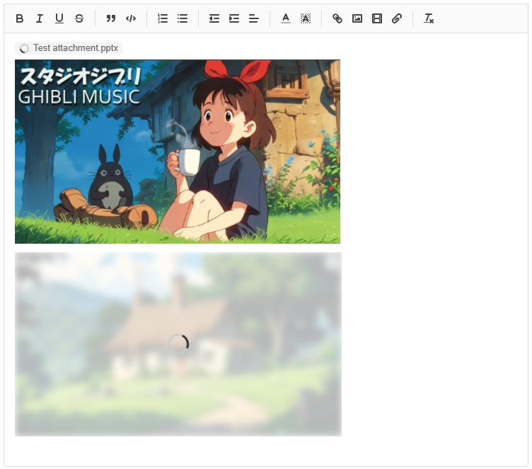
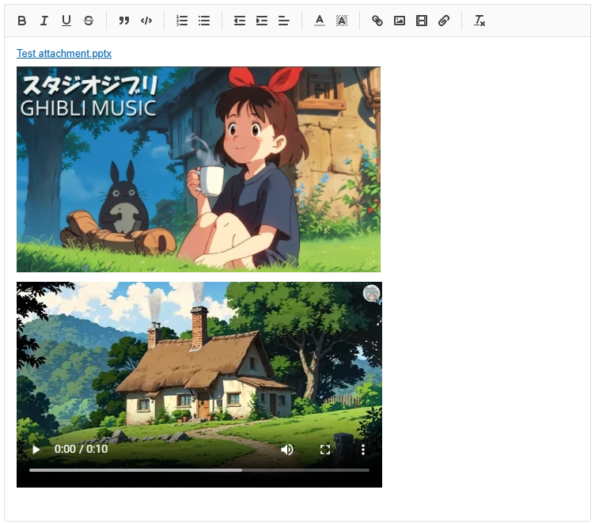

# Quill2 Uploader Module




## Usage
```javascript
import Quill from 'quill'
import 'quill/dist/quill.snow.css'

import CustomUploader from 'quill-uploader'
import attachmentIcon from 'quill/assets/icons/attachment.svg?raw'

// replace iframe video to native video tag
import Video from 'quill-formats-video'

Quill.register(Video, true)
Quill.register('modules/customUploader', CustomUploader)

const Icons = Quill.import('ui/icons')
Icons.attachment = attachmentIcon

new Quill('#editor', {
  theme: 'snow',
  modules: {
    toolbar: {
      handlers: {
        // handle attachment
        attachment: true
      }
    },
    uploader: {
      // call customUploader
      handler (range, files) {
        return this.quill.customUploader?.uploadFiles(range, files)
      }
    },
    customUploader: {
      // upload
      upload: async (_range, files) => {
        const results = await uploadFiles(files)

        return results
      }
    }
  }
})
```
